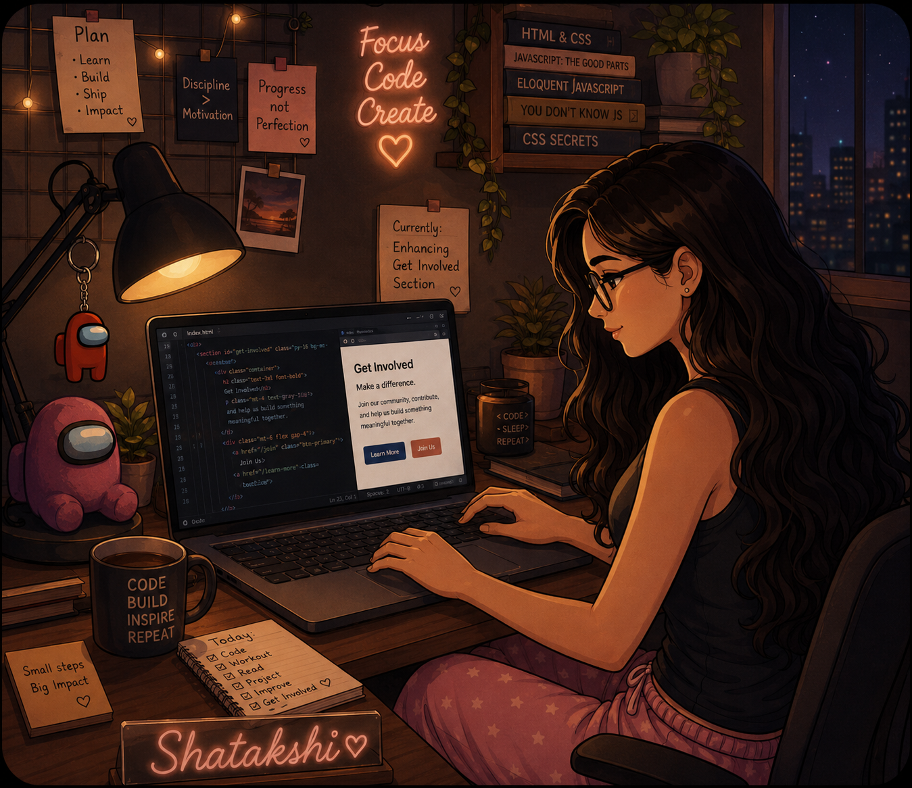

  <!-- Dynamic Banner with Aesthetic Gradient -->
  

 

<table width="100%" style="border-collapse: collapse; border: none;">
  <tr style="border: none;">
    <td width="60%" valign="top" style="border: none;">
      <h2>👩‍💻 About Me</h2>
      
I am an engineering student dedicated to <b>bridging advanced logic and clean code</b> to solve real-world technical challenges at scale. I thrive on tackling difficult algorithmic problems and refining my technical craft.

      <ul>
        <li>⚙️ <b>Focus:</b> Software Development, Algorithmic Optimization, and System Architecture.</li>
        <li>🌱 <b>Passionate:</b> Building robust, efficient systems that bridge the gap between complex logic and scalable architecture.</li>
        <li>🎮 <b>Beyond the screen:</b> I'm an avid <i>Among Us</i> player who thrives on team strategy and competitive deduction!</li>
      </ul>
    </td>
    <td width="40%" valign="top" align="center" style="border: none;">
       
      <!-- UPLOAD KI GAYI PHOTO YAHAN DIKHEGI -->
      
    </td>
  </tr>
</table>

 

<h2 align="center">🛠️ Tech Stack & Tools</h2>

  <!-- Center aligned and width increased to 85% for bigger, evenly spread icons -->
  

 

<h2 align="center">🚀 Coding Profiles</h2>

  <!-- Fetched directly from your portfolio -->
  

  
  
  

 

<h2 align="center">📊 GitHub Stats</h2>

  <!-- Cache-busting &v=1 added at the end -->
  
  

  

 

<h2>📫 Connect with Me</h2>

  
  

  <i>"If the code is not efficient, it is just resistance; I am here to make the current flow perfectly."</i>

